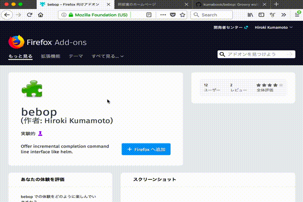

bebop
=====

[](https://travis-ci.org/kumabook/bebop)
[](https://greenkeeper.io/)
[](https://coveralls.io/github/kumabook/bebop?branch=master)
[](https://codeclimate.com/github/kumabook/bebop/maintainability)


bebop is a WebExtensions that makes your browsing groovy.

bebop is available on [Firefox Add-ons][] and [Chrome web store][]

Enjoy and swing your browsing!

About
-----


bebop is a WebExtensions that offers command line interface like
[emacs helm](https://github.com/emacs-helm/helm) for browsing.




Usage
-----

1. `Click icon on toolbar` or `Ctrl+Comma` ... show popup that has command input

    On Vivaldi, `_execute_browser_action` keyboard shortcut doesn't work.
    So, bebop offers two alternatives to it.

    | command name         | description                      |
    |:---------------------|:-------------------------------- |
    | toggle_popup_window  | show popup as a window           |
    | toggle_content_popup | show popup in a content document |

    To use these alternatives, you need to set shortcut key.
    See [Customize shortcut](#change-shortcut-key).

    NOTE: `toggle_content_popup` doesn't work completely.

    ex:

    - it doesn't work in some pages
    - it can't focus automatically from browser ui.

2. Input a query to narrow down the candidates.

    NOTE: On Windows, you need to press a tab-key to focus to a query input

    | type        | shorthand | description                     |
    |:------------|:---------:|:------------------------------- |
    | search      |           | open new tab with google search |
    | link        | l         | click a link in current page    |
    | tab         | t         | active selected tab             |
    | history     | h         | open a history                  |
    | bookmark    | b         | open a bookmark                 |

    - `:type` narrows down to the candidates whose type is the specified type
    - `x (shorthand letter)` also narrows down to the candidates whose shorthand is the specified type
    - ex.
      - `阿部寛` narrows down to the all candidates searched with `阿部寛`
      - `:link` or `l` narrow down to link candidates
      - `:link 阿部寛` or `l 阿部寛` narrow down to link candidates searched with `阿部寛`

    You can use these key-bindings in command input:

    | key-binding | command              |
    |:------------|:-------------------- |
    | C-f         | forward-char         |
    | C-b         | backward-char        |
    | C-a         | beginning-of-line    |
    | C-e         | end-of-line          |
    | C-h         | delete-backward-char |
    | C-k         | kill-line            |
    | C-g         | quit                 |


3. Select the candidate. You can change the selected candidate with shortcut keys:

    | key-binding    | command              |
    |:---------------|:-------------------- |
    | tab            | next-candidate       |
    | S-tab          | previous-candidate   |
    | C-n (only mac) | next-candidate       |
    | C-p            | previous-candidate   |
    | C-j (opt-in)   | next-candidate       |
    | C-k (opt-in)   | previous-candidate   |
    | C-SPC          | mark-candidate       |

    `C-j`, `C-k` are opt-in key-bindings. You can enable them from options page.


 You can mark multiple candidates with `C-SPC`.
 Some action can handle multiple candidates.
 For example, `close-tab` command closes multiple tabs.


4. Execute action. A candidate can be executed by various actions.
    You can execute default action by pressing `return` or click a candidate.
    You can also execute another action by these shortcuts.

    | key-binding | action                   |
    |:------------|:------------------------ |
    | return      | runs the first action   |
    | S-return    | runs the second action  |
    | C-i         | lists available actions |


You can change shortcut key from `Ctrl+Comma`.
See [Customize shortcut](#change-shortcut-key)

## Customize

### Change popup width from addon-setting page

Change popup width from `Add-ons` -> `Extensions` -> `Preferences` of `bebop`.


### Change shortcut key

#### Chromium based browser: Extensions page

1. Open `chrome://extensions/`
2. Click `Keyboard shortcuts` at thxe bottom of the page
3. Set `Activate the extension` as your favorite shortcut key
   - Vivaldi user should use `toggle_popup_window` and change `In vivaldi` to `Global`.

#### Firefox: Change shortcut key with your own private addon

You can change the shourcut key if you build and upload the addon as your own private addon.

1. Clone this repository

```sh
git clone https://github.com/kumabook/bebop.git

```

2. Edit manifest.json:

- Edit `commands._execute_browser_action.suggested_key`  with your favorite shortcut key.
- Edit `applications.gecko.id` with your id

3. Signup [developer hub](https://addons.mozilla.org/en-US/developers/addon/)
4. Get api key and api secret and set them to environment variables:

```
export NODE_ENV=production
export API_KEY=user:00000000:000
export API_SECRET=xxxxxxxxxxxxxxxxxxxxxxxxxxxxxxxxxxxxxxxxxxxxxxxxxxxxxxxxxxxxxxxx
```

5. Build and upload package as your private addon:

```
npm run sign
```

[Firefox Add-ons]:  https://addons.mozilla.org/ja/firefox/addon/bebop/
[Chrome web store]: https://chrome.google.com/webstore/detail/bebop/idiejicnogeolaeacihfjleoakggbdid
